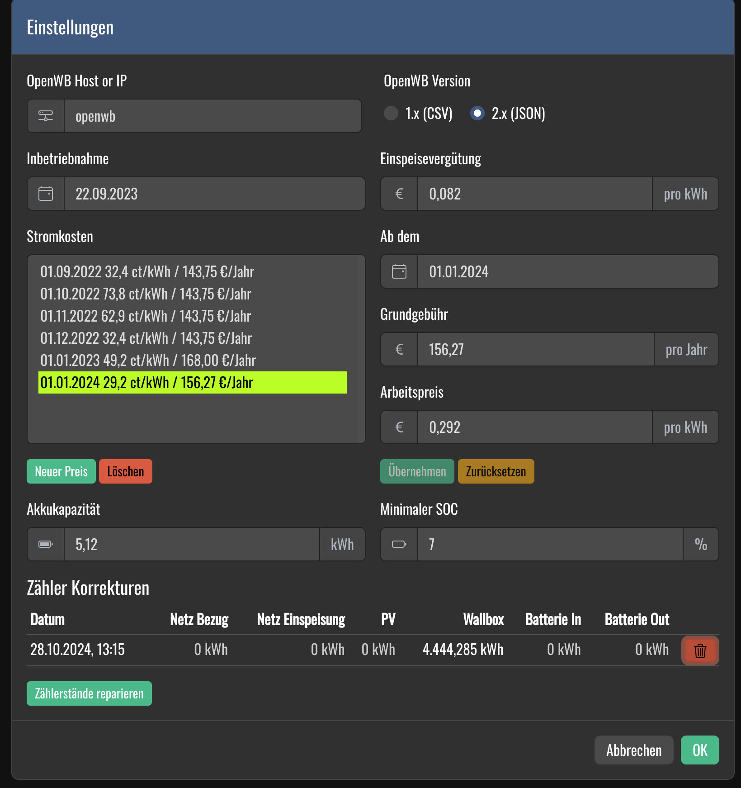

# OpenWB - Dashboard

Ein übersichtliches Dashboard für die OpenWB Wallbox mit zusätzlichen Statistiken und Informationen

## Screenshots

### Übersicht


### Einstellungen



## Getting Started

Diese Anweisungen erklären, wie man das Projekt auf einem lokalen Rechner für Entwicklungs- und Testzwecke zum Laufen bringt. Siehe [Deployment](#deployment) für Hinweise, wie das Projekt auf einem Server-System bereitgestellt werden kann.

### Vorraussetzungen

Dieses Projekt nutzt [pnpm](https://pnpm.io/) als Package-Manager.

### Installation

Zum installieren aller Abhängigkeiten:

```
pnpm install
```

ausführen.

Entwicklungs-Server starten:

```
pnpm run dev
```

## Tests

Unit-Tests sind mit _vitest_ implementiert und können mit

```
pnpm test
```

oder in _VSCode_ mit der _vitest_ Extension ausgeführt werden.

## Deployment

Mit

```
pnpm run build
```

kann das Projekt gebaut werden. Die Ausgabe im `build` Ordner kann auf einen Server mit NodeJS gehostet werden (`node index.js`).

### Docker

## Verwendete Tools und Frameworks

- [SvelteKit](https://kit.svelte.dev/) - Web Framework
- [Bootstrap](https://getbootstrap.com/) - CSS Framework
- [TypeScript](https://www.typescriptlang.org/) - Programmiersprache
- [pnpm](https://pnpm.io/) - Node Package Manager

## License

This project is licensed under the GPL-3.0 license - see the [LICENSE](LICENSE) file for details
